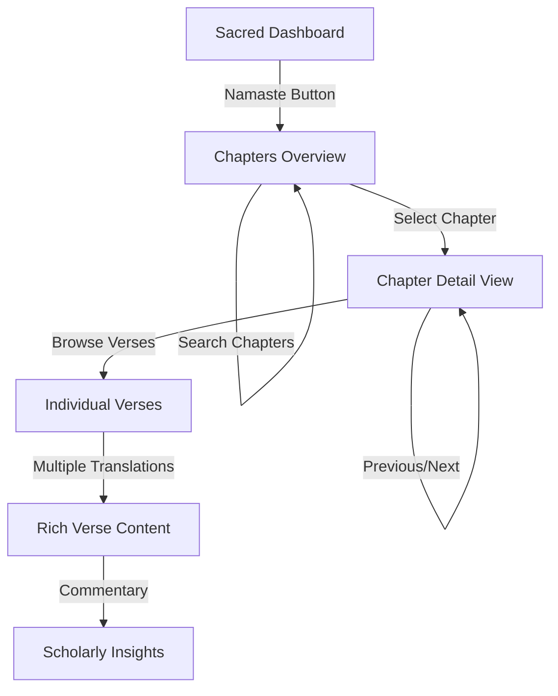

# Bhagavad Gita App 🕉️

A beauti- **Rich Content Presentation**:

- **Sanskrit Verses**: Authentic Devanagari with proper line breaks
- **Word Meanings**: Detailed Sanskrit word meanings when available
- **Transliteration**: Roman script pronunciation guide
- **Multiple English Translations**: Support for different scholars and authors
- **Hindi Translations**: Comprehensive Hindi commentary support
- **Scholarly Commentaries**: Access to traditional and modern interpretations
- **Translation Selector**: Switch between different English translation authorsmersive web application for reading and studying the Bhagavad Gita, built with modern React, TypeScript, and spiritual design principles. Experience the timeless wisdom of Krishna's teachings through an elegant, accessible digital interface.

## ✨ Features

### 🏛️ **Sacred Dashboard Experience**

- **Spiritual Welcome**: Beautiful Sanskrit greeting with "Namaste" to begin your journey
- **Divine Aesthetics**: Gradient backgrounds inspired by traditional Indian art (oranges, reds, golds)  
- **Sacred Typography**: Authentic Devanagari fonts (Noto Sans Devanagari, Mangal)
- **Interactive Journey**: Feature cards showcasing app capabilities
- **Inspirational Content**: Random sacred verse quotes with translations
- **Theme Toggle**: Dark/Light mode support for comfortable reading

### � **Comprehensive Chapter Navigation**

- **All 18 Chapters**: Complete Bhagavad Gita with real API integration
- **Smart Search**: Real-time filtering across Sanskrit names, transliterations, and meanings
- **Rich Chapter Cards**:
  - Sanskrit names with proper Devanagari rendering
  - Roman transliteration for pronunciation guidance  
  - English translations and spiritual meanings
  - Verse counts and detailed chapter summaries
- **Live Data**: Real-time integration with Bhagavad Gita API via RapidAPI

### 🎯 **Immersive Chapter Experience**

- **Comprehensive Verse Display**: Individual pages for each chapter with complete spiritual content
- **Intelligent Navigation**:
  - Sticky header with chapter context
  - Scrollable sidebar with all verses for instant access
  - Previous/Next verse navigation with keyboard support
- **Rich Content Presentation**:
  - **Sanskrit Verses**: Authentic Devanagari with proper line breaks
  - **Multiple English Translations**: Support for different scholars and authors
  - **Hindi Translations**: Comprehensive Hindi commentary support
  - **Scholarly Commentaries**: Access to traditional and modern interpretations
  - **Translation Selector**: Switch between different English translation authors
  - **Audio Ready**: UI prepared for Sanskrit recitation playback

### 🛡️ **Robust Technical Foundation**

- **Dual API Strategy**:
  - Primary: Vercel serverless functions for CORS resolution
  - Fallback: Direct RapidAPI integration with proper error handling
- **Advanced Error Handling**:
  - Automatic retry logic with fallback mechanisms
  - Timeout protection (10-second request limits)
  - Network status monitoring with `useNetworkStatus` hook
  - Descriptive error messages with troubleshooting hints
- **Performance Optimized**:
  - Intelligent loading states
  - Efficient state management with Zustand
  - Responsive image loading
  - Smooth transitions and animations

### 🎨 **Modern Design Philosophy**

- **Fully Responsive**: Perfect experience on desktop, tablet, and mobile
- **Spiritual Color Palette**: Warm oranges, deep reds, and golden accents
- **Glass Morphism**: Modern UI with backdrop blur effects and transparency (`backdrop-blur-md`, `bg-white/70`)
- **Modern UI Components**: Built with Tailwind CSS and ShadCN UI
- **Accessibility First**: Proper contrast ratios, keyboard navigation, screen reader support
- **Smooth Interactions**: Elegant hover effects and micro-animations

## 🛠️ Tech Stack

### **Core Framework**

- **React 19** with **TypeScript** for type safety and modern features
- **TanStack Router** for file-based routing with dynamic parameters
- **Zustand** for lightweight, efficient state management
- **Vite** with proxy configuration for development and lightning-fast builds

### **UI & Design System**

- **Tailwind CSS 4.0** for utility-first styling
- **ShadCN UI Components** for consistent, accessible design system
- **Lucide React** for beautiful, consistent iconography
- **Custom CSS** for Sanskrit fonts and spiritual aesthetics
- **Responsive Grid Layouts** for multi-device compatibility

### **Development & Build Tools**

- **Bun** as package manager for speed and efficiency
- **Biome** for consistent linting and code formatting
- **TypeScript** for robust type checking and developer experience
- **Vite Proxy Server** for CORS resolution and API management
- **Hot Module Replacement** for instant development feedback

### **API Integration & Data Management**

- **RapidAPI Integration** with Bhagavad Gita API v2
- **Proxy Server Configuration** for CORS bypass and header management
- **Advanced Retry Logic** with exponential backoff for reliability
- **Request Timeout Handling** for better user experience
- **Network Status Monitoring** for connectivity awareness

## 🔌 API Integration & Dual Strategy

### **Dual API Approach**

The app implements a sophisticated dual-strategy approach for maximum reliability:

1. **Primary Strategy**: Vercel serverless functions (`/api` routes)
2. **Fallback Strategy**: Direct RapidAPI integration with CORS headers

```typescript
// Dual strategy implementation in gitaStore.ts
const fetchWithRetryAndFallback = async (endpoint, options, retries = 2, timeout = 10000) => {
  // First try: Vercel API route
  try {
    const response = await fetch(`${API_BASE_URL}${endpoint}`, options);
    if (response.ok) return response;
    throw new Error(`Vercel API failed with status: ${response.status}`);
  } catch (error) {
    // Fallback: Direct RapidAPI call
    const response = await fetch(`${FALLBACK_API_BASE_URL}${endpoint}`, {
      ...options,
      headers: {
        'x-rapidapi-host': RAPIDAPI_HOST,
        'x-rapidapi-key': RAPIDAPI_KEY,
        ...options.headers,
      },
    });
    return response;
  }
};
```

### **Vercel API Routes**

For production deployment, we use Vercel serverless functions to handle CORS:

```javascript
// api/chapters.js
export default async function handler(req, res) {
  // Set CORS headers
  res.setHeader('Access-Control-Allow-Origin', '*');
  
  const response = await fetch(`${process.env.RAPIDAPI_BASE_URL}/chapters/?skip=${skip}&limit=${limit}`, {
    headers: {
      'x-rapidapi-host': process.env.RAPIDAPI_HOST,
      'x-rapidapi-key': process.env.RAPIDAPI_KEY,
    },
  });
  
  const data = await response.json();
  res.status(200).json(data);
}
```

### **Development Proxy**

For local development, Vite proxy handles CORS:

```typescript
// vite.config.ts - Development Proxy
server: {
  proxy: {
    '/api': {
      target: 'https://bhagavad-gita3.p.rapidapi.com/v2',
      changeOrigin: true,
      rewrite: (path) => path.replace(/^\/api/, ''),
      configure: (proxy) => {
        proxy.on('proxyReq', (proxyReq) => {
          proxyReq.setHeader('x-rapidapi-host', 'bhagavad-gita3.p.rapidapi.com');
          proxyReq.setHeader('x-rapidapi-key', 'YOUR_API_KEY');
        });
      },
    },
  },
}
```

### **API Endpoints**

#### 1. **All Chapters**

```bash
GET /api/chapters/?skip=0&limit=18
```

#### 2. **Specific Chapter**

```bash
GET /api/chapters/{id}/
```

#### 3. **Chapter Verses** (Ready)

```bash
GET /api/chapters/{id}/verses
```

#### 4. **Individual Verse**

```bash
GET /api/chapters/{chapter}/verses/{verse}/
```

### **Error Handling & Reliability**

The app implements comprehensive error handling:

```typescript
// Automatic fallback and timeout protection
const fetchWithRetryAndFallback = async (endpoint, options, retries = 2, timeout = 10000) => {
  const controller = new AbortController();
  const timeoutId = setTimeout(() => controller.abort(), timeout);
  
  try {
    // Primary: Vercel API route
    const response = await fetch(`${API_BASE_URL}${endpoint}`, {
      ...options,
      signal: controller.signal,
    });
    if (response.ok) return response;
  } catch (error) {
    // Fallback: Direct RapidAPI
    const fallbackResponse = await fetch(`${FALLBACK_API_BASE_URL}${endpoint}`, {
      ...options,
      signal: controller.signal,
      headers: {
        'x-rapidapi-host': RAPIDAPI_HOST,
        'x-rapidapi-key': RAPIDAPI_KEY,
        ...options.headers,
      },
    });
    return fallbackResponse;
  } finally {
    clearTimeout(timeoutId);
  }
};
```

## 🚀 Quick Start

### **Prerequisites**

- **Node.js 18+** or **Bun runtime**
- **Modern web browser** (Chrome, Firefox, Safari, Edge)
- **RapidAPI Key** for Bhagavad Gita API

### **Installation**

1. **Clone the repository**

   ```bash
   git clone https://github.com/ankittchauhann/Bhagwat-Gita.git
   cd Bhagwat-Gita
   ```

2. **Install dependencies**

   ```bash
   bun install
   ```

3. **Configure Environment Variables**

   **For Development:**
   Update the API key in `vite.config.ts`:

   ```typescript
   proxyReq.setHeader('x-rapidapi-key', 'your-rapidapi-key-here');
   ```

   **For Production (Vercel):**
   Set environment variables in your Vercel dashboard or `.env`:

   ```env
   RAPIDAPI_KEY=your-rapidapi-key-here
   RAPIDAPI_HOST=bhagavad-gita3.p.rapidapi.com
   RAPIDAPI_BASE_URL=https://bhagavad-gita3.p.rapidapi.com/v2
   ```

4. **Start development server**

   ```bash
   bun run dev
   ```

   App will be available at `http://localhost:3000`

5. **Build for production**

   ```bash
   bun run build
   ```

## 📁 Project Architecture

```
├── api/                        # Vercel serverless functions
│   ├── chapters.js             # Get all chapters endpoint
│   ├── health.js              # Health check endpoint
│   └── chapters/              # Chapter-specific endpoints
├── src/
│   ├── components/
│   │   ├── ui/                 # ShadCN UI Component Library
│   │   │   ├── button.tsx      # Customizable button component
│   │   │   ├── card.tsx        # Content card components
│   │   │   ├── input.tsx       # Form input components
│   │   │   └── select.tsx      # Select dropdown components
│   │   ├── Dashboard.tsx       # Sacred welcome experience with rotating verses
│   │   ├── ChaptersPage.tsx    # All chapters with search functionality
│   │   ├── ChapterPage.tsx     # Rich chapter/verse display with translations
│   │   ├── Header.tsx          # Navigation header component
│   │   └── ThemeToggle.tsx     # Dark/Light theme switcher
│   ├── store/
│   │   └── gitaStore.ts        # Zustand state management with dual API strategy
│   ├── hooks/
│   │   └── useNetworkStatus.ts # Network connectivity monitoring
│   ├── lib/
│   │   └── utils.ts            # Utility functions (cn helper, etc.)
│   ├── routes/                 # File-based routing system
│   │   ├── __root.tsx          # Root layout with navigation
│   │   ├── index.tsx           # Dashboard route (/)
│   │   ├── chapters.tsx        # Chapters listing (/chapters)  
│   │   └── chapter.$chapterId.tsx # Dynamic chapter pages
│   └── styles.css              # Global styles with Sanskrit fonts
├── public/                     # Static assets and favicons
└── vite.config.ts             # Development proxy configuration
```

## 🧭 User Journey Flow



## 🏗️ State Management Architecture

```typescript
interface GitaState {
  // Core Data
  chapters: Chapter[]              // All 18 chapters
  currentChapter: Chapter | null   // Active chapter
  verses: Verse[]                  // Chapter verses
  currentVerse: Verse | null       // Active verse
  
  // UI State
  loading: boolean                 // Loading indicator
  error: string | null            // Error messages
  
  // API Actions with Error Handling
  fetchChapters: () => Promise<void>
  fetchChapter: (id: number) => Promise<void>
  fetchVerses: (chapterId: number) => Promise<void>
  fetchVerse: (chapterId: number, verse: number) => Promise<void>
}
```

### **Enhanced Verse Interface**

```typescript
interface Verse {
  id: number
  verse_number: number
  chapter_number: number
  text: string                    // Sanskrit verse
  translations: Translation[]      // Multiple language support
  commentaries: Commentary[]       // Scholarly interpretations
}

interface Translation {
  id: number
  description: string             // Translation text
  author_name: string            // Scholar name
  language: string               // "english" | "hindi" | etc.
}
```

## 🎨 Design System

### **Sacred Color Palette**

```css
/* Primary Colors */
--orange-50: #fff7ed    /* Soft backgrounds */
--orange-500: #f97316   /* Primary actions */
--orange-600: #ea580c   /* Hover states */

/* Secondary Colors */  
--red-500: #ef4444      /* Accent elements */
--red-600: #dc2626      /* Active states */

/* Golden Accents */
--yellow-50: #fefce8    /* Subtle highlights */
--yellow-500: #eab308   /* Golden touches */

/* Neutral Grays */
--slate-600: #475569    /* Body text */
--slate-700: #334155    /* Headings */
```

### **Typography Hierarchy**

```css
/* Sanskrit Text */
font-family: 'Noto Sans Devanagari', 'Mangal', serif;

/* English Content */
font-family: 'Inter', -apple-system, BlinkMacSystemFont, sans-serif;

/* Size Scale */
--text-xs: 0.75rem      /* Captions */
--text-sm: 0.875rem     /* Body small */
--text-base: 1rem       /* Body text */
--text-lg: 1.125rem     /* Emphasis */
--text-xl: 1.25rem      /* Headings */
--text-2xl: 1.5rem      /* Page titles */
```

## 🔧 Available Scripts

```bash
# Development
bun run dev              # Start dev server with proxy
bun run build            # Production build
bun run serve            # Preview production build

# Code Quality
bun run lint             # Run Biome linter
bun run format           # Format with Biome
bun run check            # Lint + format combined

# Testing
bun run test             # Run test suite (Vitest)
```

## 🌟 Production Deployment

### **Deployment Options**

1. **Vercel** (Recommended - includes API routes)

   ```bash
   # Install Vercel CLI
   npm i -g vercel
   
   # Deploy with serverless functions
   vercel
   ```

   The app includes Vercel serverless functions in the `api/` directory for CORS handling.

2. **Netlify**

   ```bash
   # Build and deploy
   bun run build
   # Upload dist/ folder to Netlify
   ```

   Note: For Netlify, you'll need to configure serverless functions separately or use direct API calls.

3. **Custom Server**
   - Serve `dist/` folder with a static server
   - Set up proxy routes for `/api/*` endpoints

### **Environment Variables**

**For Vercel (Production):**

```env
RAPIDAPI_KEY=your-rapidapi-key-here
RAPIDAPI_HOST=bhagavad-gita3.p.rapidapi.com
RAPIDAPI_BASE_URL=https://bhagavad-gita3.p.rapidapi.com/v2
```

**For Development:**

```env
# Update in vite.config.ts
VITE_RAPIDAPI_KEY=your-api-key-here
```

## 🚧 Future Roadmap

### **Phase 1: Core Features** ✅ Completed

- [x] Rich verse display with multiple translations
- [x] Commentary integration with scholarly interpretations
- [x] Translation author selection
- [x] Enhanced error handling with dual API strategy
- [x] CORS resolution with Vercel serverless functions
- [x] Glass morphism UI with backdrop blur effects
- [x] Responsive design with spiritual aesthetics
- [x] Dark/Light theme support
- [x] Word meanings and transliteration support

### **Phase 2: Audio & Multimedia** 🔜 Next Priority

- [ ] Sanskrit pronunciation audio
- [ ] Verse-by-verse audio playback
- [ ] Audio controls and speed adjustment
- [ ] Offline audio caching

### **Phase 3: Personalization**

- [ ] Bookmark favorite verses
- [ ] Personal reading progress tracking
- [ ] Daily verse notifications
- [ ] Reading statistics and insights

### **Phase 4: Advanced Features**

- [ ] Multi-language support (Telugu, Tamil, Gujarati)
- [ ] Dark mode with spiritual themes  
- [ ] Advanced search across all verses
- [ ] Commentary comparison view
- [ ] Social sharing with beautiful verse cards

### **Phase 5: Community & Learning**

- [ ] Study guides and verse explanations
- [ ] Meditation timers with verse focus
- [ ] Community discussions and insights
- [ ] Scholar interviews and video content

## 🤝 Contributing

We welcome contributions that enhance the spiritual and technical quality of this app!

### **How to Contribute**

1. **Fork the repository**
2. **Create feature branch** (`git checkout -b feature/spiritual-enhancement`)
3. **Make changes** with proper TypeScript types
4. **Test thoroughly** across different devices
5. **Commit with meaning** (`git commit -m 'Add verse bookmarking'`)
6. **Push to branch** (`git push origin feature/spiritual-enhancement`)
7. **Create Pull Request** with detailed description

### **Development Guidelines**

- **Code Quality**: Follow TypeScript best practices
- **Accessibility**: Ensure WCAG compliance
- **Performance**: Optimize for mobile devices
- **Spirituality**: Maintain respectful, authentic content
- **Testing**: Test on multiple browsers and screen sizes

## � License

This project is licensed under the **MIT License** - see the [LICENSE](LICENSE) file for details.

## 🙏 Acknowledgments & Credits

### **Spiritual Sources**

- **Bhagavad Gita API** by RapidAPI for authentic Sanskrit content
- **Traditional Commentators** for timeless spiritual wisdom
- **Modern Scholars** for accessible translations

### **Technical Foundation**

- **ShadCN** for beautiful, accessible UI components
- **Tailwind CSS** for expressive, maintainable styling
- **TanStack Router** for elegant routing solutions
- **Zustand** for simple, effective state management
- **Vite** for lightning-fast development experience

### **Design Inspiration**

- **Traditional Indian Art** for color palettes and aesthetics  
- **Modern Web Design** for accessibility and user experience
- **Sanskrit Typography** for authentic spiritual presentation

---

## 🕉️ About the Bhagavad Gita

The **Bhagavad Gita** ("The Divine Song") is a 700-verse Sanskrit scripture that forms part of the ancient Indian epic **Mahabharata**. It presents a profound dialogue between **Prince Arjuna** and **Lord Krishna** at the sacred battlefield of Kurukshetra.

### **Universal Teachings**

- **🏛️ Dharma** - Righteous duty and moral responsibility
- **⚡ Karma** - Action, intention, and spiritual consequences  
- **🕉️ Moksha** - Liberation and ultimate spiritual realization
- **💝 Bhakti** - Devotion, love, and surrender to the Divine

### **Timeless Relevance**

The Gita addresses fundamental human questions:

- How to live with purpose and meaning
- Balancing duty with personal desires  
- Finding peace amidst life's challenges
- Discovering our true spiritual nature

This app aims to make these profound teachings accessible to modern seekers while preserving the **spiritual authenticity** and **sacred wisdom** of the original Sanskrit text.

---

## 🌟 Final Words

> **"यदा यदा हि धर्मस्य ग्लानिर्भवति भारत।  
> अभ्युत्थानमधर्मस्य तदात्मानं सृजाम्यहम्॥"**  
>
> *"Whenever there is decline in righteousness and rise in unrighteousness, O Arjuna, at that time I manifest myself on earth."* - **Bhagavad Gita 4.7**

May this digital offering serve as a bridge between ancient wisdom and modern technology, bringing the eternal light of Krishna's teachings to seekers around the world.

**🕉️ Om Shanti Shanti Shanti 🙏**

---

<div align="center">

### **Ready to Begin Your Spiritual Journey?**

**[🚀 Launch the App](http://localhost:3000) | [📖 Read the Gita](http://localhost:3000/chapters) | [🙏 Start with Namaste](http://localhost:3000)**

*Built with � for spiritual seekers everywhere*

</div>

</div>
